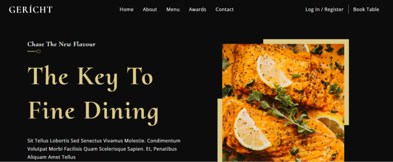
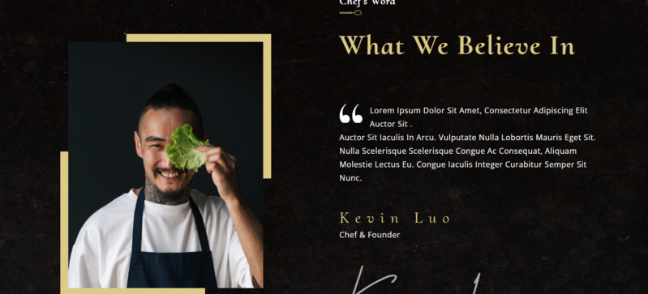
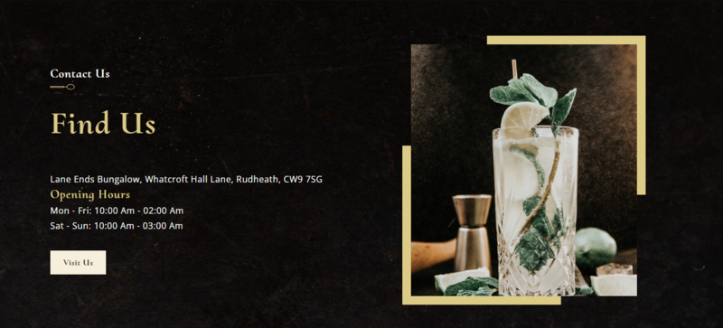

# Restaurante

La aplicación del Restaurante Moderno es una solución innovadora que combina la tecnología de vanguardia con la experiencia culinaria. Diseñada y desarrollada utilizando React y TypeScript, esta aplicación proporciona una plataforma interactiva y fácil de usar para los clientes del restaurante.


## Tecnologías principales
 React  
 TypeScript  
 Vite  
 Netlify  
 Tailwind  
 

## Capturas de pantalla
Aquí se muestran las capturas de pantalla de la página web en la versión de escritorio:
 
 
 


## Empezando

Primero, ejecute el servidor de desarrollo:

```

npm install
# or
yarn instll

# and Now:

npm run dev
# or
yarn dev
```

## Créditos
El proyecto fue creado a partir de un video tutorial de JavaScript Mastery titulado "Cree e implemente un sitio web de restaurante totalmente receptivo con una interfaz de usuario moderna y UX en ReactJS". Puedes encontrar el video tutorial en [este enlace](https://www.youtube.com/watch?v=4oV65GVVits).

## Enlace
Puedes acceder a la página web en el siguiente enlace:
[URL del sitio](https://keen-beijinho-22f500.netlify.app)

